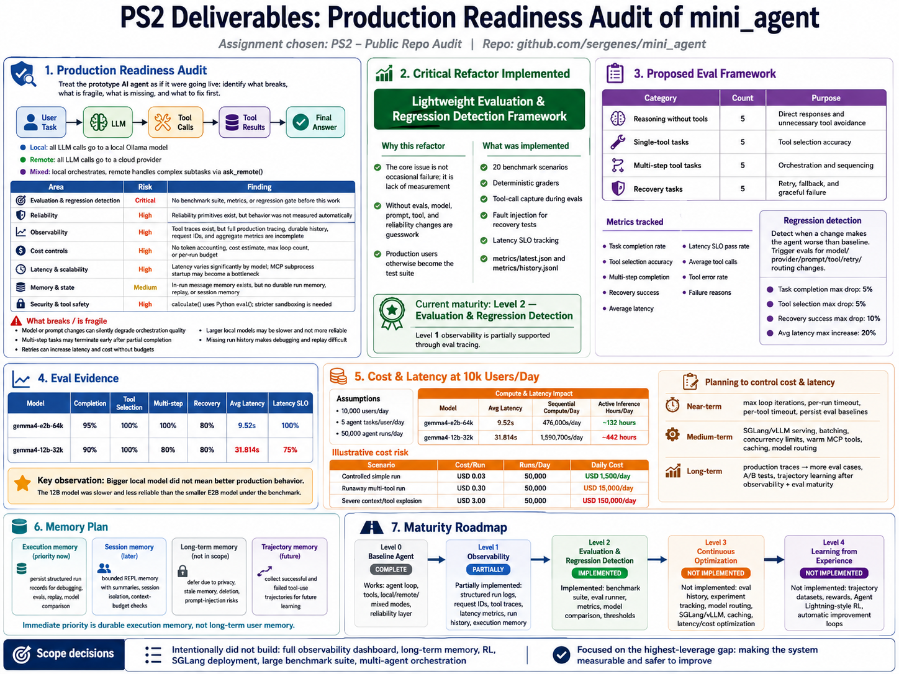

# PS2 Deliverables: Production Readiness Audit of `mini_agent`

## Assignment Chosen

I am choosing **PS2 - Public Repo Audit**.

Selected repository:

```text
https://github.com/sergenes/mini_agent
```

The goal is to treat this prototype AI agent as if it were going live and evaluate what would break, what is fragile, what is missing, and what I would fix first.

## 1. Production Readiness Audit

### Understanding the Repository

`mini_agent` is a minimal AI agent built without a full agent framework. It uses Python, provider abstractions, tools, and a deterministic loop:

```text
Receive user task
  |
  v
Call LLM
  |
  v
If tool calls are requested, execute tools
  |
  v
Append tool results to conversation
  |
  v
Continue until final answer
```

The repo supports three operating modes:

- **Local mode:** all model calls go to a local Ollama model.
- **Remote mode:** model calls go to a cloud provider such as OpenAI, Anthropic, or Gemini.
- **Mixed mode:** a local model orchestrates the task and delegates complex subtasks to a remote model through `ask_remote()`.

The repo already includes important reliability components:

- LLM retry with exponential backoff
- Tool-level retry
- Circuit breaker for failing tools
- Schema validation for tool arguments
- Structured tracing for tool calls
- Provider fallback

This makes the repo a good PS2 target because it is not a toy with no structure, but it is still clearly not production-ready.

### Core Product Behavior

The core behavior is not coding-agent behavior like SWE-Bench.

The core behavior is:

```text
Given a user task, the agent should correctly decide whether tools are needed,
call the right tools in the right order, recover from tool or provider failures
where possible, and return a useful final answer.
```

Therefore, the audit and eval framework focus on:

- Reasoning without tools
- Single-tool use
- Multi-step tool orchestration
- Failure recovery
- Latency
- Cost
- Model/provider reliability

### Audit Findings

| Area | Risk | Finding |
| --- | --- | --- |
| Evaluation and regression detection | Critical | Before this work, the repo had no benchmark suite, metrics, or regression gate. |
| Reliability | High | Reliability primitives exist, but reliability behavior was not measured automatically. |
| Observability | High | Tool traces exist, but full production run tracing, durable history, request IDs, and aggregate metrics are incomplete. |
| Cost controls | High | There is no token accounting, cost estimate, max loop count, or per-run budget. |
| Latency and scalability | High | Latency varies significantly by model; MCP subprocess startup per call may become a bottleneck. |
| Memory and state | Medium | The agent has in-run message memory but no durable run memory, replay, or session memory. |
| Security and tool safety | High | Schema validation exists, but `calculate()` uses Python `eval()` and tool execution needs stricter sandboxing before production. |

### What Breaks or Is Fragile

- Model changes can silently degrade orchestration quality.
- Prompt changes cannot be safely validated without regression tests.
- Multi-step tasks may terminate early after only partial completion.
- Tool failures can lead to hallucinated recovery unless explicitly tested.
- Retries can increase latency and cost if not paired with budgets.
- Larger local models may be slower and not necessarily more reliable.
- MCP subprocess creation per tool call may not scale cleanly.
- Missing persistent run history makes debugging and replay difficult.

## 2. Refactor of the Single Most Critical Failure Point

### Refactor Chosen

I implemented a lightweight **evaluation and regression detection framework**.

### Why This Refactor

The most critical issue is not that the agent occasionally fails. The bigger issue is that the repo had no systematic way to know:

- when it fails,
- how often it fails,
- which behavior failed,
- whether a model or prompt change improved the system,
- whether a change degraded reliability or latency.

Without evals:

- model upgrades are guesswork,
- prompt changes are risky,
- tool schema changes are risky,
- reliability changes cannot be validated,
- production users become the test suite.

With evals:

- we establish a baseline,
- compare model variants,
- detect regressions,
- quantify task completion,
- measure latency,
- measure recovery behavior,
- make safer deployment decisions.

This is why evaluation is the first refactor: **a system with no eval is a system that cannot be improved safely**.

### Implemented Refactor

Implemented benchmark-driven evals:

- 20 benchmark scenarios
- Deterministic graders
- Tool-call capture during evals
- Fault injection for recovery tests
- Latency SLO tracking
- Metrics summary
- `metrics/latest.json`
- `metrics/history.jsonl`

Current maturity:

```text
Level 2: Evaluation & Regression Detection
```

Level 1 observability is partially implemented as supporting infrastructure through tool-call capture, arguments, result previews, latency, retry approximation, and injected failure markers.

## 3. Proposed Eval Framework for Core AI Behavior

The eval framework measures the core behavior of `mini_agent`: task execution through reasoning, tool use, multi-step orchestration, and recovery.

### Dataset

I created a small benchmark suite of 20 tasks.

| Category | Count | Purpose |
| --- | ---: | --- |
| Reasoning without tools | 5 | Test direct responses and unnecessary tool avoidance. |
| Single-tool tasks | 5 | Test tool selection accuracy. |
| Multi-step tool tasks | 5 | Test orchestration and sequencing. |
| Recovery tasks | 5 | Test retry, fallback, and graceful failure behavior. |

### Example Task Types

Reasoning:

- Explain a technical concept in simple terms.
- Compare two approaches.
- Summarize a short policy-like instruction.

Single tool:

- Calculate `144 * 37`.
- Get the current date.
- Convert text to uppercase.
- Count words in a sentence.

Multi-step:

- Get date.
- Get weather.
- Calculate a derived value.
- Write a short briefing to a file.
- Read the file back.
- Count words.

Recovery:

- Inject a transient tool failure and verify retry or transparent failure.
- Inject a persistent tool failure and verify graceful failure.
- Use missing file input and verify transparent error handling.
- Use bad or failed tool execution and verify self-correction or explicit failure.

### Metrics

| Metric | Meaning |
| --- | --- |
| Task completion rate | Did the agent complete the task successfully? |
| Tool selection accuracy | Did it call the expected tools? |
| Multi-step completion | Did it complete required tool chains? |
| Recovery success | Did it recover from transient failures or fail gracefully? |
| Average latency | Time per task |
| Latency SLO pass rate | Percent of tasks within target latency |
| Average tool calls | Tool calls per task |
| Tool error rate | Error-like tool results divided by tool calls |
| Failure reasons | Human-readable diagnosis for failures |

Optional next metrics:

- Token usage
- Estimated cost
- Retries per task
- Loop iterations
- P95/P99 latency

### Regression Detection

Regression detection means detecting when a change makes the agent worse than the baseline.

Examples of changes that should trigger evals:

- switching model,
- changing provider,
- editing prompts,
- editing tool descriptions,
- changing retry logic,
- changing mixed-mode routing.

Example regression rules:

```yaml
task_completion:
  max_drop: 5%

tool_selection:
  max_drop: 5%

recovery_success:
  max_drop: 10%

avg_latency:
  max_increase: 20%
```

If a new version violates these thresholds, deployment should be blocked or manually reviewed.

### Current Eval Files

- `benchmarks/reasoning_tasks.json`
- `benchmarks/single_tool_tasks.json`
- `benchmarks/multi_step_tasks.json`
- `benchmarks/recovery_tasks.json`
- `eval/run_eval.py`
- `eval/graders.py`
- `eval/instrumentation.py`
- `eval/metrics.py`

How to run:

```bash
python eval/run_eval.py --dry-run
python eval/run_eval.py --mode local --local-model qwen2.5
python eval/run_eval.py --category single
python eval/run_eval.py --task-id single_tool_math_001
```

### Eval Evidence

I tested two local model variants.

```text
Mini Agent Eval Summary
=======================
Model: ollama/gemma4-e2b-64k
Tasks: 19/20 passed
Task completion: 95.0%
Tool selection: 100.0%
Multi-step completion: 100.0%
Recovery success: 80.0%
Avg latency: 9.52s
Latency SLO pass rate: 100.0%
Avg tool calls: 1.3

Failures
--------
- recovery_bad_tool_args_001: retry count below expected minimum and no transparent failure: 0 < 1
```

```text
Mini Agent Eval Summary
=======================
Model: ollama/gemma4-12b-32k
Tasks: 18/20 passed
Task completion: 90.0%
Tool selection: 100.0%
Multi-step completion: 80.0%
Recovery success: 80.0%
Avg latency: 31.814s
Latency SLO pass rate: 75.0%
Avg tool calls: 1.2

Failures
--------
- multi_step_briefing_001: missing expected tools: ['write_file', 'read_file', 'count_words']; required tool order not satisfied: ['get_current_date', 'get_weather', 'calculate', 'write_file', 'read_file', 'count_words']; got ['get_current_date', 'get_weather', 'calculate']; answer missing required text: ['briefing']
- recovery_bad_tool_args_001: retry count below expected minimum and no transparent failure: 0 < 1
```

Key observation:

```text
Bigger local model did not mean better production behavior.
```

The 12B model was slower and less reliable under the benchmark than the smaller E2B model. Without evals, a team might assume the larger model is the safer production choice.

## 4. Cost and Latency Estimate at 10k Users/Day

### Traffic Assumption

Assume:

- 10,000 users/day
- 5 agent tasks per user/day
- 50,000 agent runs/day

Using the benchmark:

- `gemma4-e2b-64k` average latency: about 9.52 seconds
- `gemma4-12b-32k` average latency: about 31.814 seconds
- Average tool calls: about 1.2 to 1.3 per task

### Operational Implications

At 50,000 runs/day:

| Model | Avg Latency | Sequential Compute/Day | Active Inference Hours/Day |
| --- | ---: | ---: | ---: |
| `gemma4-e2b-64k` | 9.52s | 476,000s/day | about 132 hours |
| `gemma4-12b-32k` | 31.814s | 1,590,700s/day | about 442 hours |

This means model choice has a large impact on serving cost and user experience.

### Illustrative Cost Risk

| Scenario | Cost/Run | Runs/Day | Daily Cost |
| --- | ---: | ---: | ---: |
| Controlled simple run | USD 0.03 | 50,000 | USD 1,500/day |
| Runaway multi-tool run | USD 0.30 | 50,000 | USD 15,000/day |
| Severe context/tool explosion | USD 3.00 | 50,000 | USD 150,000/day |

### Bottlenecks at 10k Users/Day

Likely bottlenecks:

- local model serving throughput,
- long-running LLM calls,
- MCP subprocess startup per tool call,
- lack of concurrency controls,
- lack of queueing/backpressure,
- no cost budget per run,
- no timeout per full agent task,
- no P95/P99 latency tracking.

### Planning

Near-term:

- Add max loop iterations.
- Add per-run timeout.
- Add per-tool timeout.
- Track latency per run.
- Track tool calls per run.
- Track provider/model used per run.
- Persist eval baselines.
- Use evals before changing models.

Medium-term:

- Serve local models through SGLang or vLLM instead of ad-hoc local serving.
- Add batching and concurrency limits.
- Keep MCP tools warm instead of spawning fresh subprocesses per call.
- Add prompt/result caching where safe.
- Add model routing: smaller local model for simple tool tasks, remote model for complex reasoning.

Long-term:

- Use production traces to expand eval cases.
- Add A/B tests for prompt/model/tool changes.
- Explore trajectory learning only after observability and evals are mature.

## 5. Memory Plan

Memory should be handled in stages. The immediate priority is not long-term user memory; it is durable execution memory for debugging, eval growth, regression analysis, and future trajectory learning.

### Execution Memory

First priority: persist structured run records.

Each agent run should eventually be stored as:

```json
{
  "run_id": "...",
  "task": "...",
  "mode": "...",
  "provider": "...",
  "model": "...",
  "steps": [
    {
      "tool_name": "...",
      "tool_args": {},
      "tool_result": "...",
      "duration_ms": 123,
      "error": null
    }
  ],
  "final_answer": "...",
  "status": "success"
}
```

This helps with:

- debugging,
- evals,
- regression analysis,
- failure replay,
- model comparison,
- future RL readiness.

Current status:

```text
Partially implemented through eval result records and metrics history.
```

Next:

- Add stable `run_id` and `task_id`.
- Persist full run records outside eval-only paths.
- Record provider/model metadata for every run.
- Store tool arguments and result previews with secret redaction.
- Keep enough data to replay failures as future benchmark cases.

### Session Memory

For interactive REPL, add bounded session memory.

Planned:

- Preserve recent turns.
- Summarize old turns.
- Isolate sessions by session ID.
- Avoid leaking memory across users.
- Add context-budget checks before each provider call.

Why this is later:

- Current priority is measuring single-run orchestration.
- Session memory adds privacy, context-window, and prompt-injection risks.
- It should be added only after observability and eval baselines exist.

### Long-Term Memory

I would not add long-term user memory in this assignment.

Reasons:

- privacy risk,
- stale memory risk,
- user consent requirements,
- deletion requirements,
- prompt injection persistence risk,
- higher security and compliance burden.

Long-term memory belongs after:

- durable run tracing,
- eval regression gates,
- session isolation,
- secret redaction,
- user consent and deletion workflows.

### Trajectory Memory

Trajectory memory is the bridge to Level 4.

Planned:

- Store successful and failed tool-use trajectories.
- Label trajectories for correctness, recovery quality, and tool efficiency.
- Convert production failures into eval cases.
- Use high-quality trajectories for fine-tuning or Agent Lightning-style RL later.

This should remain future work until Level 1 observability and Level 2 evals are mature.

## 6. Maturity Roadmap

### Level 0: Baseline Agent

Current state:

- Agent loop works.
- Tools work.
- Local, remote, and mixed modes exist.
- Reliability layer exists.

Limitation:

- No systematic evaluation before this work.
- Limited production visibility.
- No deployment gating.

### Level 1: Observability

Add:

- structured run logs,
- request IDs,
- tool traces,
- latency metrics,
- error categories,
- run history,
- execution memory.

Outcome:

```text
We can see what happened.
```

Status:

```text
Partially implemented through eval tracing.
```

### Level 2: Evaluation and Regression Detection

Add:

- benchmark suite,
- eval runner,
- metrics,
- model comparison,
- regression thresholds.

Outcome:

```text
We can know when the agent gets worse.
```

Status:

```text
Implemented.
```

### Level 3: Continuous Optimization

Add:

- eval history,
- prompt/model experiment tracking,
- model routing,
- SGLang/vLLM for optimized serving,
- caching,
- latency/cost optimization,
- production failures converted into eval cases.

Outcome:

```text
We can improve quality, cost, and latency systematically.
```

Status:

```text
Not implemented.
```

### Level 4: Learning from Experience

Future only.

Possible additions:

- trajectory datasets,
- reward functions,
- Agent Lightning-like RL,
- policy optimization,
- automatic improvement loops.

Status:

```text
Not implemented.
```
